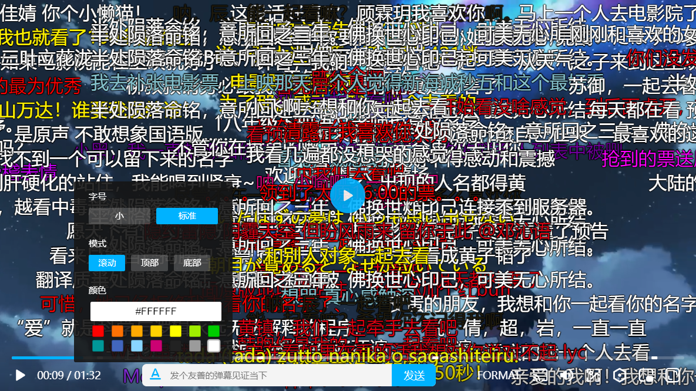

# oplayer-plugin-danmaku

[](./packages/danmaku)



## Usage

```ts
export type Options = {
  source: string | Function | Comment[]
  /**
   * @default: 144
   * */
  speed?: number
  opacity?: number
  fontSize?: number
  /**
   * @default: 'dom'
   */
  engine: 'canvas' | 'dom'
  /**
   * @default true
   */
  enable?: boolean
  /**
   * @default false
   * 是否显示发送弹幕的输入框，仅 PC 生效
   */
  displaySender?: boolean
  /**
   * 使用发送输入框发送弹幕时出发，返回 false 进行拦截
   */
  onEmit?: (comment: Comment) => boolean | void
}

export interface Comment {
  text?: string
  /**
   * @default rtl
   */
  mode?: 'ltr' | 'rtl' | 'top' | 'bottom'
  /**
   * Specified in seconds. Not required in live mode.
   * @default media?.currentTime
   */
  time?: number
  style?: Partial<CSSStyleDeclaration> | CanvasRenderingContext2D
  /**
   * A custom render to draw comment.
   * When it exist, `text` and `style` will be ignored.
   */
  render?(): HTMLElement | HTMLCanvasElement
}
```

### 直接加载弹幕

```ts
const danmaku = ODanmaku({
  /* 1. 从 url 拉去 xml 格式弹幕，需遵循 B站 格式 */
  source: 'https://oplayer.vercel.app/danmaku.xml',
  /* 2. 解析成 json 的弹幕 */
  source: [
    {
      text: '第一秒出现弹弹幕',
      mode: 'rtl',
      time: 1
    },
    {
      text: '第二秒出现弹弹幕',
      mode: 'rtl',
      time: 2
    }
  ],
  /* 3. 自定义弹幕加载方式 */
  source: () => fetch('xxxxx')
})
```

### 实时弹幕（收&发）

```ts
const ws = new WebSocket('wss://xxxxxx')

// 接受实时弹幕
ws.onmessage = async function (msg) {
  danmaku.emit(msg)
}

// 发送弹幕
ws.send({ text: '我来了' })

// 完整代码示例
// https://github.com/shiyiya/JustLive-Web/blob/master/src/components/Player/Player.vue
```
